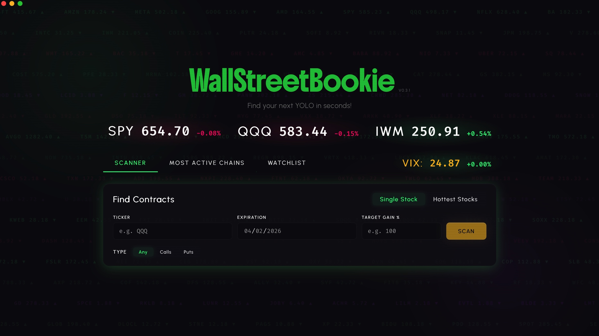
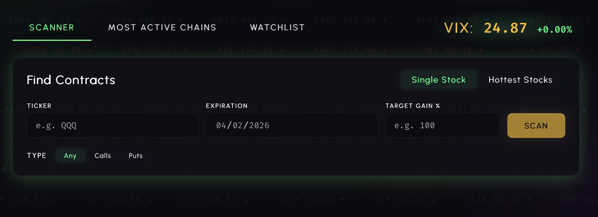
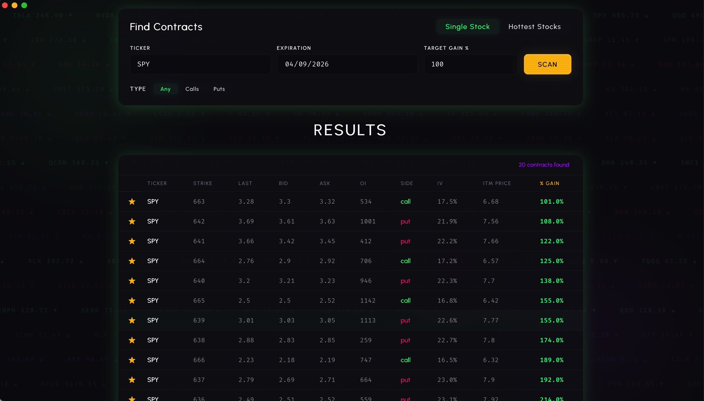
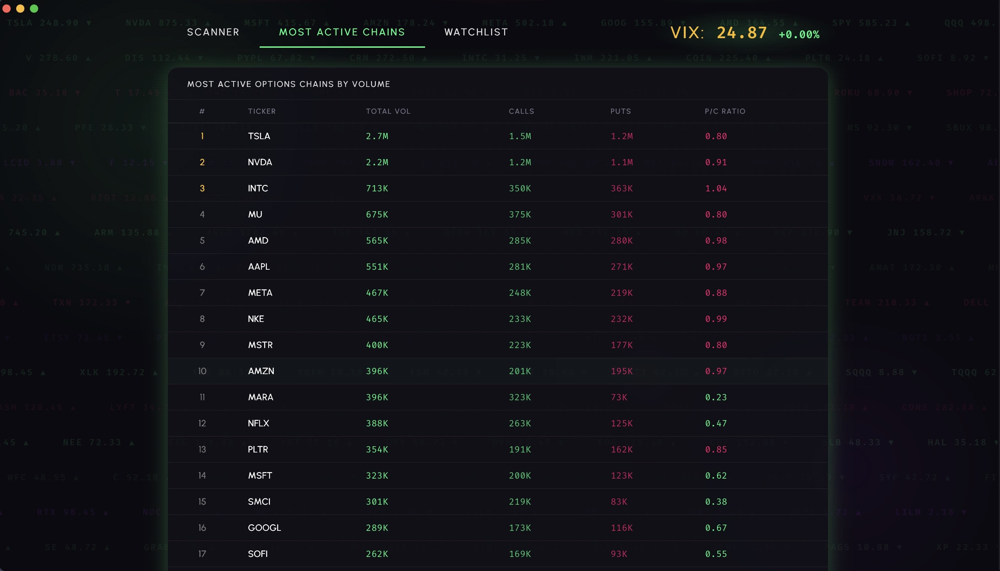
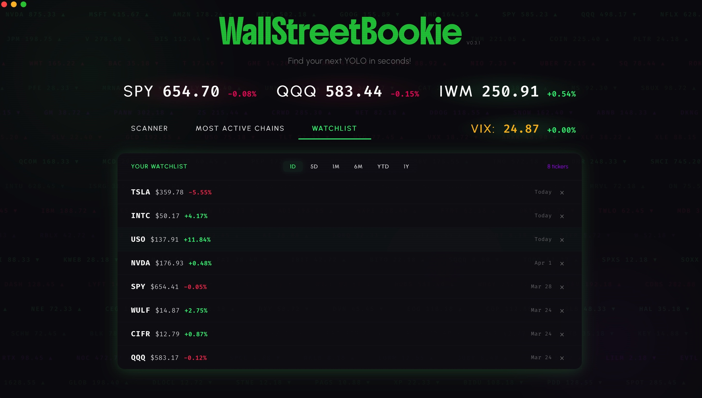
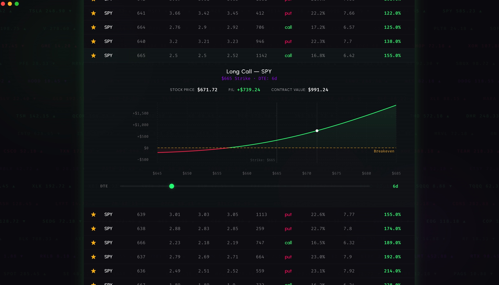

# WallStreetBookie



**WallStreetBookie** is a high-performance desktop options scanner designed for day traders to find out-of-the-money (OTM) contracts hitting specific profit targets. The application features a persistent market ticker strip and real-time VIX context, providing traders with an immediate sense of market sentiment and volatility as they navigate the UI. Built with a robust Python backend and a modern React frontend, it provides powerful simulation tools to identify and analyze high-potential trades.

## 🚀 Key Features

### 🔍 Profit Calculator (Options Scanner)

The core of WallStreetBookie. Find contracts that match your specific risk/reward profile.

- **Smart Filtering**: Input a ticker, expiration date, and a target "Times Gain" (multiplier). The scanner filters thousands of contracts to find only those projected to hit your target.
- **Call/Put Flexibility**: Toggle between scanning for Calls, Puts, or both simultaneously.
- **Hottest Stocks Mode**: One-click scan for the top 3 most active options chains in the market, saving you the time of manual ticker entry.
- **Data Normalization**: Handles varied date formats and API quirks behind the scenes to ensure consistent results.






---

### 🔥 Most Active Options Chains

Identify where the "smart money" and retail volume are flowing.

- **Ranked Volume**: A dedicated view of the highest-volume options chains across the market.
- **Sentiment Analysis**: Automatically calculates Put/Call ratios with a 0.7 "Bullish" threshold to highlight market sentiment at a glance.
- **ETF vs. Equity**: Switch between broad market ETFs and individual equity chains to find specialized opportunities.



---

### ⭐ Unified Watchlist & Multi-Timeframe Performance

WallStreetBookie offers a unique, high-efficiency watchlist that does more than just track prices. It provides a "bird's-eye view" of your entire group of favorite stocks across multiple horizons simultaneously.

- **Multi-Horizon Performance**: A standout feature that allows you to instantly toggle the performance of your *entire* watchlist across six critical timeframes: **1D, 5D, 1M, 6M, YTD, and 1Y**. This unparalleled convenience enables traders to spot relative strength and emerging trends across their custom basket of stocks without the friction of checking individual charts.
- **Dynamic Pricing**: Real-time stock price tracking integrated directly into the list view.
- **One-Click Curation**: Star any ticker directly from the search results or the "Most Active" tables to instantly add or remove it from your tracking list.
- **Persistent Local Storage**: Your watchlist is stored locally in a lightweight JSON format, ensuring your data is private, portable, and persists across application updates.



---

### 📉 P/L Charting & Decay Simulation

Visualize your potential outcomes with a sophisticated charting engine.

- **Black-Scholes Modeling**: Professional-grade P/L curves calculated using real-time Greek data.
- **Live DTE Slider**: Simulate time decay (Theta) by dragging the DTE slider. Watch the curve flatten or expand in real-time to see how time affects your trade.
- **Metrics Bar**: A persistent HUD above the chart showing Stock Price, P/L, and Contract Value at any point on the curve. Updates instantly as you hover.
- **Reference Overlays**: Clear indicators for Strike Price, Current Underlying Price, and the critical Breakeven line.



---

## 🛠 Tech Stack

| Layer | Technology |
|-------|------------|
| **Desktop Shell** | [pywebview](https://pywebview.flowrl.com/) (Python 3.12) |
| **Frontend** | React 19 + Vite + Recharts |
| **Backend** | Python 3.12 with JS Bridge (`api.py`) |
| **Data Layer** | Custom wrappers for `yfinance`, `yahoo-fin`, `finnhub`, and `beautifulsoup4` |
| **Styling** | Vanilla CSS (Glassmorphism / Cyberpunk aesthetic) |

---

## ⚙️ Getting Started

### Prerequisites

- Python 3.12+
- Node.js 18+
- Poetry (`pip install poetry`)

### Installation

1. **Python Dependencies**:

   ```bash
   cd src
   poetry install
   ```

2. **Frontend Dependencies**:

   ```bash
   cd src/frontend
   npm install
   ```

### Running the Application

- **Development Mode**: Spawns a Vite dev server and opens the pywebview window with hot-reloading.

  ```bash
  cd src
  WALLSTBOOKIE_DEV=1 python -m backend.main
  ```

- **Production Mode**: Build the frontend first, then launch the standalone desktop app.

  ```bash
  cd src/frontend
  npm run build
  cd ..
  python -m backend.main
  ```

---

## 📜 License

Copyright © 2026. All rights reserved.

This software and its source code are proprietary. Unauthorized copying, modification, distribution, or commercial use — in whole or in part — is strictly prohibited without explicit written permission from the author.
