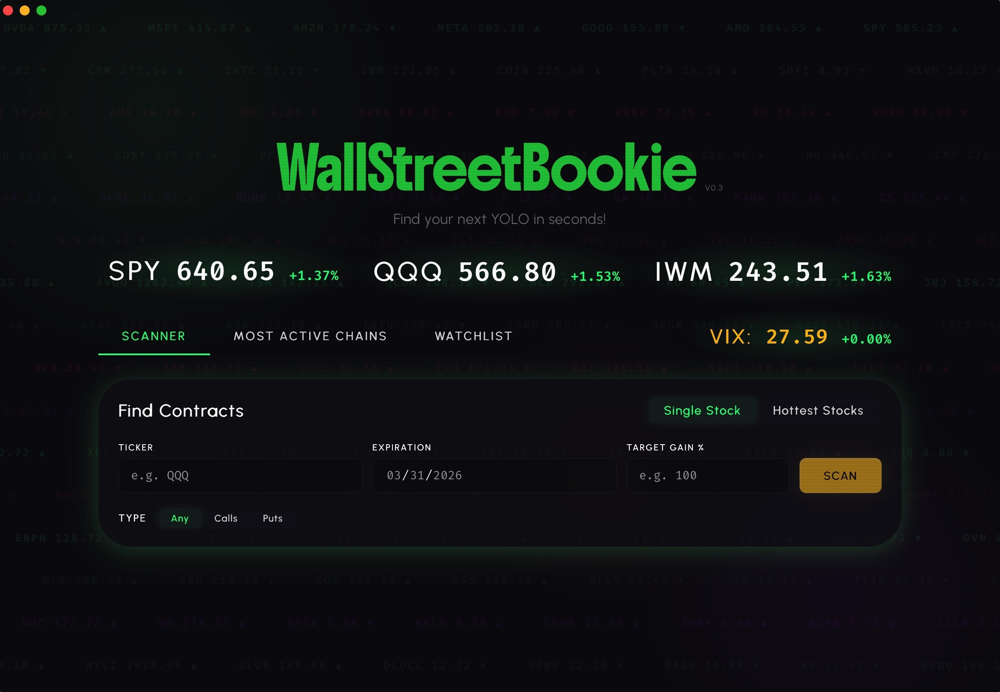

# WallStreetBookie


A desktop options scanner that finds OTM (out-of-the-money) contracts projected to hit a user-defined profit target. Built with Python + pywebview on the backend and React + Vite on the frontend. Made with high risk tolerance day traders in mind, but applicable in a variety of use cases.

## What It Does

Enter a ticker, expiration date, and desired gain percentage — WallStreetBookie scans the options chain and returns contracts that could yield your target return if the underlying moves to the strike price. It also surfaces the most active options chains by volume so you can find where the action is.

### Features

- **Profit Calculator** — scan for OTM calls, puts, or both on any ticker
- **Hottest Stocks mode** — auto-scan the top 3 most active options chains instead of a single ticker
- **Most Active Chains** — ranked view of the highest-volume options chains
- **Market Ticker Strip** — live SPY, QQQ, IWM, and VIX prices with performance indicators
- **Watchlist** — save and track favorite tickers with live price updates
- **P/L Chart** — Black-Scholes powered profit/loss curve with adjustable DTE slider

## Tech Stack

| Layer | Tech |
|-------|------|
| Desktop shell | [pywebview](https://pywebview.flowrl.com/) |
| Frontend | React 19 + Vite |
| Backend | Python 3.12 |
| Data | yfinance, yahoo-fin, finnhub, beautifulsoup4, selenium |
| Package mgmt | Poetry (Python), npm (JS) |

## Getting Started

### Prerequisites

- Python 3.12+
- Node.js 18+
- Poetry (`pip install poetry`)

### Install

```bash
# Python dependencies
cd src
poetry install

# Frontend dependencies
cd frontend
npm install
```

### Run (dev mode)

```bash
cd src
WALLSTBOOKIE_DEV=1 python -m backend.main
```

This starts the Vite dev server and opens the pywebview window pointed at `localhost:5173`.

### Run (production)

```bash
# Build the frontend first
cd src/frontend
npm run build

# Then launch
cd ..
python -m backend.main
```

## Status

Functional and in active polish — core scanning, P/L charting, and watchlist are all working. Known open issue: DTE slider drag triggers window move on macOS (pywebview 6.1 intercepts drags below the JS layer).

## License

Copyright © 2026. All rights reserved.

This software and its source code are proprietary. Unauthorized copying, modification, distribution, or commercial use — in whole or in part — is strictly prohibited without explicit written permission from the author.
